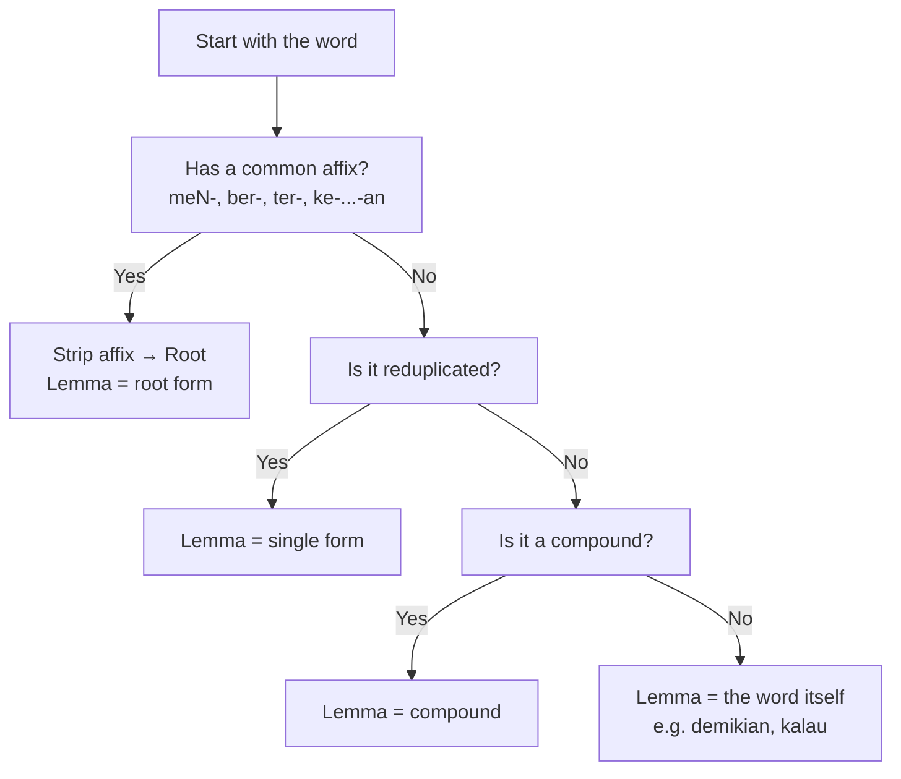

# 🌱 Malay Lemma Decision Guide

A quick reference for identifying **lemmas (root forms)** in Bahasa Melayu.

---

## 1. Check if it looks **affixed**
- **Prefixes:** meN-, ber-, ter-, peN-, ke-, di-, se-, per-  
- **Suffixes:** -kan, -i, -an, -nya  
- **Circumfixes:** ke-…-an, per-…-an  

👉 If yes → strip the affix to find the **root**.

| Word        | Analysis                   | Lemma   |
|-------------|----------------------------|---------|
| menimpa     | meN- + timpa               | timpa   |
| berjalan    | ber- + jalan               | jalan   |
| kesyukuran  | ke- … -an + syukur         | syukur  |
| perbuatan   | per- … -an + buat          | buat    |

---

## 2. Check if it’s **reduplicated**
👉 Lemma is the **single form**.

| Word        | Type               | Lemma   |
|-------------|--------------------|---------|
| buku-buku   | full reduplication | buku    |
| lari-lari   | full reduplication | lari    |
| sayur-mayur | partial reduplication | sayur |

---

## 3. Check if it’s a **compound**
👉 Lemma is usually the **whole compound**.

| Word         | Meaning         | Lemma        |
|--------------|-----------------|--------------|
| kereta api   | train           | kereta api   |
| alat tulis   | stationery      | alat tulis   |
| rumah sakit  | hospital (MS: hospital) | rumah sakit |

---

## 4. If none applies → it’s **already a lemma**
Some words look like they might have affixes historically, but are synchronically root words.

| Word      | Notes                                   | Lemma     |
|-----------|-----------------------------------------|-----------|
| demikian  | historically demi + -kian, but frozen   | demikian  |
| kalau     | conjunction, no root to strip           | kalau     |
| supaya    | subordinating conjunction               | supaya    |
| sungguh   | “truly, really”                         | sungguh   |

---

## ⚡ Quick Mnemonic
- **Strip what is clearly added → lemma is root.**  
- **If nothing looks added → lemma is the word itself.**

---

## 🔎 Malay Lemma Flowchart

