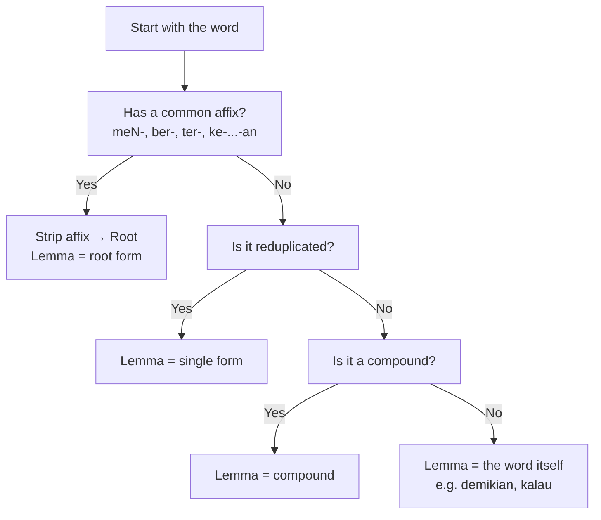

# 📘 Malay Derivation Cheatsheet

Malay uses **affixes** (prefixes, suffixes, circumfixes) to form new words.  
Some affixes are **productive** (can be used to freely form new words),  
while others are **non-productive/negative** (fixed forms, limited in use).

---

## 🔹 Productive Prefixes

### **meN-**  
**Function:** Forms **active verbs** (often transitive).  
- Adds sense of *"to do an action"*.  
- Assimilates depending on first letter of root. Can be *me-, mem-, men-, men-, meng-, menge-, meny-*.

**Example:**  
- *tulis (write)* → **menulis** (*to write*)  
- *ajar (teach)* → **mengajar** (*to teach*)  

**Rule of Thumb**

Use it when someone **does or makes something** to an object (transitive).
Example: membuat kuih (make a cake).

---

### **ber-**  
**Function:** Forms **intransitive verbs** (often stative or habitual).  
- Adds sense of *"to have / to use / to do"*.  

**Example:**  
- *tulis* → **bertulis** (*written / bearing writing*)  
- *baju (shirt)* → **berbaju** (*to wear clothes*)  

**Rule of Thumb**

Use it when someone **has, is, or does something by themselves** (intransitive or reflexive).
Example: berjalan (walk), bekerja (work).

---

### **ter-**  
**Function:** Forms **stative verbs** or **accidental actions**.  
- Adds sense of *"happened by itself / accidentally / the most"*.
- Adds the perfective aspect of the verb (*"placed" → "has been placed"*)

**Example:**  
- *tulis* → **tertulis** (*written down, inscribed, accidentally written*)
- *lihat (look)* → **terlihat** (*visible / accidentally saw*)  
- *tujah (thrust, jab)* → **tertujah** (*accidentally jabbed*)  
- *letak (place)* → **terletak** (*have been placed*)

---

### **peN-**  
**Function:** Forms **agent nouns** (the doer of an action).  
- Like English *-er*.  
- Assimilates depending on first letter of root. Can be *pe-, pen-, peng-, peny-, pem-, per, pel-*.

**Example:**  
- *tulis* → **penulis** (*writer*)  
- *ajar (teach)* → **pengajar** (*teacher*)  

---

## 🔹 Productive Circumfixes

### **peN- -an**  
**Function:** Forms **abstract nouns** of actions, processes, or results.  

**Example:**  
- *tulis* → **penulisan** (*writing, composition*)  
- *bangun (get up)* → **pembangunan** (*development*)  

---

### **ke- -an**  
**Function:** Forms **abstract/stative nouns** (states, qualities, or conditions).  
- Often = *-ness* or *state of being*.  

**Example:**  
- *tulis* → **ketulisan** (*state of being truthful / literalness*)  
- *besar (big)* → **kebesaran** (*greatness*)  
- *sakit (sick)* → **kesakitan** (*pain, illness*)  

---

### **meN- -kan**  
**Function:** Causative or applicative verb formation.  
- Derived from combining **meN-** and **-kan**.  
- Expresses **causation** (“to make [something/someone] do or become something”) or **application** (“to do [something] for/on someone”).  
- Considered **derivational** because it changes the base meaning significantly.  

**Examples:**  
- *tulis* → **menuliskan** (*to write [something] for someone / to inscribe*)  
- *panas (hot)* → **memanaskan** (*to heat [something], to make hot*)  
- *ingat (remember)* → **mengingatkan** (*to remind*)  

---

### **per- -an**  
**Function:** Forms **nouns of actions/events**.  

**Example:**  
- *tulis* → **pertulisan** (*script, writing system, inscription*)  
- *main (play)* → **permainan** (*game, play*)  
- *jumpa (meet)* → **perjumpaan** (*meeting*)  

---

## 🔹 Productive Suffixes

### **-kan**  
**Function:** Forms **causative / transitive verbs** (*to make, to cause*).  

**Example:**  
- *tulis* → **tuliskan** (*write [something] down / write for someone*)  
- *besar (big)* → **besarkan** (*enlarge, raise*)  
- *ingat (remember)* → **ingatkan** (*remind*)  

---

### **-kah**  
**Function:** Question particle suffix.  
- Turns statements into **yes/no** or **wh-** questions.  
- Can attach to verbs, adjectives, pronouns, or question words.  
- Unlike other suffixes, **-kah** is **grammatical**, not **derivational** — it affects sentence mood rather than forming new words.  

**Example:**  
- *tulis* → **tuliskah?** (*is [it] written?*)  
- *apa (what)* → **apakah** (*what? / is it?*)  
- *betul (correct)* → **betulkah** (*is it true?*)  
- *mungkin (maybe)* → **mungkinkah** (*is it possible?*)  

---

### **-lah**  
**Function:** Emphatic or polite particle.  
- Used to **soften imperatives**, **emphasize statements**, or make speech more **friendly**.  
- Like **-kah**, it is **grammatical**, not **derivational** — it doesn’t create new words but changes the **tone or mood** of the sentence.  
- Very common in spoken and written Malay.

**Examples:**  
- *tulis* → **tulislah!** (*please write! / go ahead and write!*)  
- *ini (here)* → **inilah** (*this is it / here it is*)  
- *mari (come on)* → **marilah** (*let’s go!*)  
- *cuba (try)* → **cubalah** (*try it!*)  

---

### **-i**  
**Function:** Forms **locative or repetitive verbs** (*to do something to/on*).  

**Example:**  
- *tulis* → **tulisi** (*to write on something repeatedly*)  
- *isi (content)* → **isini** (*to fill something*)  
- *cuci (wash)* → **cucii** (*to wash repeatedly*)  

---

### **-an**  
**Function:** Forms **nouns** (things or results of actions).  

**Example:**  
- *tulis* → **tulisan** (*writing, text, handwriting*)  
- *makan (eat)* → **makanan** (*food*)  
- *baca (read)* → **bacaan** (*reading material*)  

### **-nya**  
**Function:** Multi-purpose suffix.  
1. **Definite marker** (*the*).  
   - *tulisan* → **tulisannya** (*the writing*)  
2. **Third person possessive** (*his/her/its*).  
   - *tulisan* → **tulisannya** (*his writing*)  
3. **Nominalizer** (*-ness*, *the fact that*).  
   - *tertulis* → **tertulisnya** (*the fact of being written*)  
4. **Adverbial/emphatic**.  
   - *cepat* → **cepatnya** (*so fast!*)  

---

## 🔹 Non-Productive / Negative Affixes

These affixes are less “productive” — they don’t freely generate new words, but serve grammatical or lexicalized functions.

### **di-**  
**Function:** Forms **passive verbs**.  
- Action is received rather than done.  

**Example:**  
- *tulis* → **ditulis** (*is written*)  
- *makan (eat)* → **dimakan** (*is eaten*)  
- *tangkap (catch)* → **ditangkap** (*is caught*)  

---

### **se-**  
**Function:** Forms words with meaning *"one, whole, same, together"*.  
- Often lexicalized.  

**Example:**  
- *tulis* → **setulis** (*as written / one writing*)  
- *orang (person)* → **seorang** (*one person*)  
- *kampung (village)* → **sekampung** (*whole village*)  
- *rupa (appearance)* → **serupa** (*similar*)  

---

### **juru-**  
**Function:** Forms profession nouns.  
- Limited to a fixed set of words.  

**Example:**  
- (*tulis* doesn’t take this, but related: **jurutulis** = clerk/scribe*)  
- *cakap (speak)* → **jurucakap** (*spokesperson*)  
- *tera (smart)* → **jurutera** (*engineer*)  

---

### **maha-**  
**Function:** Intensifier, *"great, supreme"*.  
- Not freely attached, often in elevated/loanwords.  

**Example:**  
- (not applicable for *tulis*)  
- *besar (big)* → **mahabesar** (*very great*)  
- *raja (king)* → **maharaja** (*emperor*)  

---

### **tuna-**  
**Function:** Indicates **lack/deprivation**.  
- Limited set.  

**Example:**  
- (not applicable for *tulis*)  
- *rungu (hear)* → **tunarungu** (*deaf*)  
- *netra (eye)* → **tunanetra** (*blind*)  

---

### **eka-/dwi-/tri-/panca-** (Sanskrit origin)  
**Function:** Malay and Sanskrit-derived prefixes used to express *number*, *unity*, or *comparison*.

| Prefix | Origin | Meaning | Example | Meaning |
|:--------|:--------|:----------|:----------|:----------|
| **se-** | Native Malay | one / a / same | *seorang*, *sekali*, *setulis* | one person, once, as written |
| **eka-** | Sanskrit | one / single | *ekabahasa* | monolingual |
| **dwi-** | Sanskrit | two / dual | *dwibahasa* | bilingual |
| **tri-** | Sanskrit | three | *trisakti* | threefold / triple power |
| **panca-** | Sanskrit | five | *Pancasila* | five principles |

---

## ✨ Quick Reference

| Affix                 | Function / Meaning              | Example (from *tulis*)             |
|-----------------------|---------------------------------|------------------------------------|
| meN-                  | active verb (to do)             | menulis (*to write*) |
| ber-                  | intransitive verb               | bertulis (*bearing writing*) |
| ter-                  | stative / accidental            | tertulis (*inscribed*) |
| peN-                  | doer / agent                    | penulis (*writer*) |
| peN- -an              | abstract noun (process)         | penulisan (*writing*) |
| ke- -an               | state / quality                 | ketulisan (*literalness*) |
| meN- -kan             | causative or applicative verbs  | menuliskan (to write (for someone)) |
| per- -an              | action/event noun               | pertulisan (*script*) |
| -kan                  | causative verb                  | tuliskan (*write it down*) |
| -kah                  | question/focus particle         | tuliskah (*did [someone] write?*) |
| -lah                  | emphatic or polite particle     | tulislah! (*please write!*) |
| -i                    | locative/repetitive verb        | tulisi (*write on*) |
| -an                   | noun (thing/result)             | tulisan (*writing/text*) |
| -nya                  | definite/possessive/nominalizer | tulisannya (*the/his writing*) |
| di-                   | passive verb                    | ditulis (*is written*) |
| se-                   | one/whole/same                  | setulis (*as written*) |
| juru-                 | profession                      | jurutulis (*scribe*) |
| maha-                 | supreme/intensifier             | mahabesar (*very great*) |
| tuna-                 | lack / deprivation              | tunarungu (*deaf*) |
| eka-/dwi-/tri-/panca- | number forms                    | dwitulisan (*bilingual writing*) |

---

## 🌳 Malay Derivation Flowchart (*tulis*)

```mermaid
flowchart TD

A["tulis (root)"] --> B["meN- → menulis (to write)"]
A --> C["ber- → bertulis (bearing writing)"]
A --> D["ter- → tertulis (inscribed)"]
A --> E["peN- → penulis (writer)"]

E --> E1["peN- -an → penulisan (writing, composition)"]

A --> F["ke- -an → ketulisan (literalness)"]
A --> G["per- -an → pertulisan (script, writing system)"]

A --> H["-kan → tuliskan (write [something] down)"]
A --> I["-i → tulisi (write on repeatedly)"]
A --> J["-an → tulisan (writing, text)"]

J --> J1["-nya → tulisannya (the/his writing)"]
D --> D1["-nya → tertulisnya (the fact of being written)"]

A --> K["di- → ditulis (is written)"]
A --> L["se- → setulis (as written)"]
A --> M["juru- → jurutulis (scribe)"]

%% Non-productive others
X["besar (root)"] --> N["maha- → mahabesar (very great)"]
Y["rungu (hearing)"] --> O["tuna- → tunarungu (deaf)"]
Z["dwibahasa (two languages)"] --> P["dwitulisan (bilingual writing)"]
```

# 🌱 Malay Lemma Decision Guide

A quick reference for identifying **lemmas (root forms)** in Bahasa Melayu.

---

## 1. Check if it looks **affixed**
- **Prefixes:** meN-, ber-, ter-, peN-, ke-, di-, se-, per-  
- **Suffixes:** -kan, -i, -an, -nya  
- **Circumfixes:** ke-…-an, per-…-an  

👉 If yes → strip the affix to find the **root**.

| Word        | Analysis                   | Lemma   |
|-------------|----------------------------|---------|
| menimpa     | meN- + timpa               | timpa   |
| berjalan    | ber- + jalan               | jalan   |
| kesyukuran  | ke- … -an + syukur         | syukur  |
| perbuatan   | per- … -an + buat          | buat    |

---

## 2. Check if it’s **reduplicated**
👉 Lemma is the **single form**.

| Word        | Type               | Lemma   |
|-------------|--------------------|---------|
| buku-buku   | full reduplication | buku    |
| lari-lari   | full reduplication | lari    |
| sayur-mayur | partial reduplication | sayur |

---

## 3. Check if it’s a **compound**
👉 Lemma is usually the **whole compound**.

| Word         | Meaning         | Lemma        |
|--------------|-----------------|--------------|
| kereta api   | train           | kereta api   |
| alat tulis   | stationery      | alat tulis   |
| rumah sakit  | hospital (MS: hospital) | rumah sakit |

---

## 4. If none applies → it’s **already a lemma**
Some words look like they might have affixes historically, but are synchronically root words.

| Word      | Notes                                   | Lemma     |
|-----------|-----------------------------------------|-----------|
| demikian  | historically demi + -kian, but frozen   | demikian  |
| kalau     | conjunction, no root to strip           | kalau     |
| supaya    | subordinating conjunction               | supaya    |
| sungguh   | “truly, really”                         | sungguh   |

---

## ⚡ Quick Mnemonic
- **Strip what is clearly added → lemma is root.**  
- **If nothing looks added → lemma is the word itself.**

---

## 🔎 Malay Lemma Flowchart

