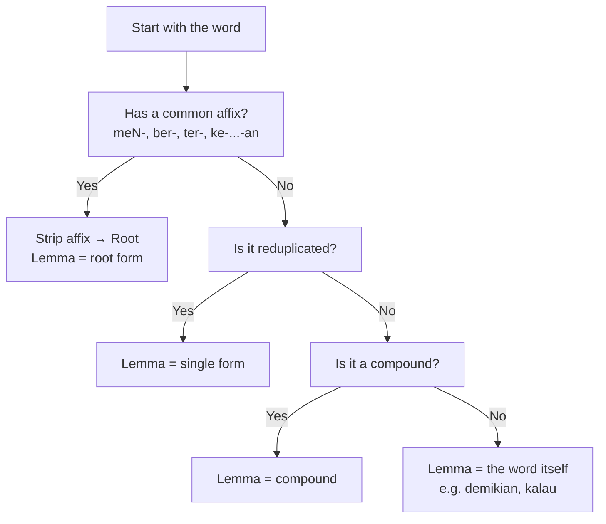

# 📘 Malay Derivation Cheatsheet

Malay uses **affixes** (prefixes, suffixes, circumfixes) to form new words.  
Some affixes are **productive** (can be used to freely form new words),  
while others are **non-productive/negative** (fixed forms, limited in use).

---

## 🔹 Productive Prefixes

### **meN-**  
**Function:** Forms **active verbs** (often transitive).  
- Adds sense of *"to do an action"*.  
- Assimilates depending on first letter of root.  

**Example:**  
- *tulis* → **menulis** (*to write*)  
- *ajar* → **mengajar** (*to teach*)  

---

### **ber-**  
**Function:** Forms **intransitive verbs** (often stative or habitual).  
- Adds sense of *"to have / to use / to do"*.  

**Example:**  
- *jalan* → **berjalan** (*to walk*)  
- *baju* → **berbaju** (*to wear clothes*)  

---

### **ter-**  
**Function:** Forms **stative verbs** or **accidental actions**.  
- Adds sense of *"happened by itself / accidentally / the most"*.  

**Example:**  
- *lihat* → **terlihat** (*visible / accidentally saw*)  
- *besar* → **terbesar** (*biggest*)  

---

### **peN-**  
**Function:** Forms **agent nouns** (the doer of an action).  
- Like English *-er*.  

**Example:**  
- *ajar* → **pengajar** (*teacher*)  
- *tulis* → **penulis** (*writer*)  

---

## 🔹 Productive Circumfixes

### **peN- -an**  
**Function:** Forms **abstract nouns** of actions, processes, or results.  

**Example:**  
- *tulis* → **penulisan** (*writing, composition*)  
- *bangun* → **pembangunan** (*development*)  

---

### **ke- -an**  
**Function:** Forms **abstract/stative nouns** (states, qualities, or conditions).  
- Often = *-ness* or *state of being*.  

**Example:**  
- *besar* → **kebesaran** (*greatness*)  
- *sakit* → **kesakitan** (*pain, illness*)  

---

### **per- -an**  
**Function:** Forms **nouns of actions/events**.  

**Example:**  
- *main* → **permainan** (*game, play*)  
- *jumpa* → **perjumpaan** (*meeting*)  

---

## 🔹 Productive Suffixes

### **-kan**  
**Function:** Forms **causative / transitive verbs** (*to make, to cause*).  

**Example:**  
- *besar* → **besarkan** (*enlarge, raise*)  
- *ingat* → **ingatkan** (*remind*)  

---

### **-i**  
**Function:** Forms **locative or repetitive verbs** (*to do something to/on*).  

**Example:**  
- *isi* → **isini** (*to fill something*)  
- *cuci* → **cucii** (*to wash repeatedly*)  

---

### **-an**  
**Function:** Forms **nouns** (things or results of actions).  

**Example:**  
- *makan* → **makanan** (*food*)  
- *baca* → **bacaan** (*reading material*)  

---

## 🔹 Non-Productive / Negative Affixes

These affixes are less “productive” — they don’t freely generate new words, but serve grammatical or lexicalized functions.

### **di-**  
**Function:** Forms **passive verbs**.  
- Action is received rather than done.  

**Example:**  
- *makan* → **dimakan** (*is eaten*)  
- *tangkap* → **ditangkap** (*is caught*)  

---

### **se-**  
**Function:** Forms words with meaning *"one, whole, same, together"*.  
- Often lexicalized.  

**Example:**  
- **seorang** (*one person*)  
- **sekampung** (*whole village*)  
- **serupa** (*similar*)  

---

### **juru-**  
**Function:** Forms profession nouns.  
- Limited to a fixed set of words.  

**Example:**  
- **jurucakap** (*spokesperson*)  
- **jurutera** (*engineer*)  

---

### **maha-**  
**Function:** Intensifier, *"great, supreme"*.  
- Not freely attached, often in elevated/loanwords.  

**Example:**  
- **mahasiswa** (*university student*)  
- **maharaja** (*emperor*)  
- **Maha Esa** (*The One God*)  

---

### **tuna-**  
**Function:** Indicates **lack/deprivation**.  
- Limited set.  

**Example:**  
- **tunarungu** (*deaf*)  
- **tunanetra** (*blind*)  

---

### **eka-/dwi-/tri-/panca-** (Sanskrit origin)  
**Function:** Number-based prefixes, limited.  

**Example:**  
- **ekabahasawan** (*monolingual*)  
- **dwibahasa** (*bilingual*)  
- **trisuku** (*three tribes*)  
- **pancaindera** (*five senses*)  

---

## ✨ Quick Reference

| Affix      | Meaning / Function         | Example |
|------------|---------------------------|---------|
| meN-       | active verb (to do)       | menulis (*to write*) |
| ber-       | intransitive verb         | berjalan (*to walk*) |
| ter-       | stative / accidental      | terlihat (*visible*) |
| peN-       | doer / agent              | penulis (*writer*) |
| peN- -an   | abstract noun (process)   | penulisan (*writing*) |
| ke- -an    | state / quality           | kebesaran (*greatness*) |
| per- -an   | action / event noun       | permainan (*game*) |
| -kan       | causative verb            | ingatkan (*remind*) |
| -i         | locative / repetitive     | cucii (*wash repeatedly*) |
| -an        | noun (thing/result)       | makanan (*food*) |
| di-        | passive verb              | dimakan (*is eaten*) |
| se-        | one/whole/same            | seorang (*one person*) |
| juru-      | profession                | jurutera (*engineer*) |
| maha-      | supreme/intensifier       | maharaja (*emperor*) |
| tuna-      | lack / deprivation        | tunarungu (*deaf*) |
| eka-/dwi-/tri-/panca- | number forms   | pancaindera (*five senses*) |

---

# 🌱 Malay Lemma Decision Guide

A quick reference for identifying **lemmas (root forms)** in Bahasa Melayu.

---

## 1. Check if it looks **affixed**
- **Prefixes:** meN-, ber-, ter-, peN-, ke-, di-, se-, per-  
- **Suffixes:** -kan, -i, -an, -nya  
- **Circumfixes:** ke-…-an, per-…-an  

👉 If yes → strip the affix to find the **root**.

| Word        | Analysis                   | Lemma   |
|-------------|----------------------------|---------|
| menimpa     | meN- + timpa               | timpa   |
| berjalan    | ber- + jalan               | jalan   |
| kesyukuran  | ke- … -an + syukur         | syukur  |
| perbuatan   | per- … -an + buat          | buat    |

---

## 2. Check if it’s **reduplicated**
👉 Lemma is the **single form**.

| Word        | Type               | Lemma   |
|-------------|--------------------|---------|
| buku-buku   | full reduplication | buku    |
| lari-lari   | full reduplication | lari    |
| sayur-mayur | partial reduplication | sayur |

---

## 3. Check if it’s a **compound**
👉 Lemma is usually the **whole compound**.

| Word         | Meaning         | Lemma        |
|--------------|-----------------|--------------|
| kereta api   | train           | kereta api   |
| alat tulis   | stationery      | alat tulis   |
| rumah sakit  | hospital (MS: hospital) | rumah sakit |

---

## 4. If none applies → it’s **already a lemma**
Some words look like they might have affixes historically, but are synchronically root words.

| Word      | Notes                                   | Lemma     |
|-----------|-----------------------------------------|-----------|
| demikian  | historically demi + -kian, but frozen   | demikian  |
| kalau     | conjunction, no root to strip           | kalau     |
| supaya    | subordinating conjunction               | supaya    |
| sungguh   | “truly, really”                         | sungguh   |

---

## ⚡ Quick Mnemonic
- **Strip what is clearly added → lemma is root.**  
- **If nothing looks added → lemma is the word itself.**

---

## 🔎 Malay Lemma Flowchart

